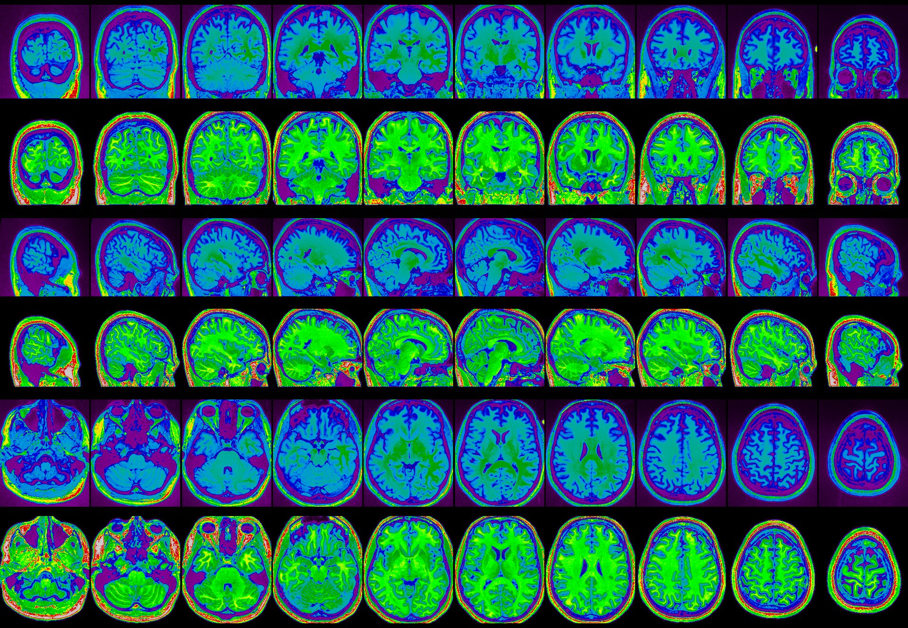
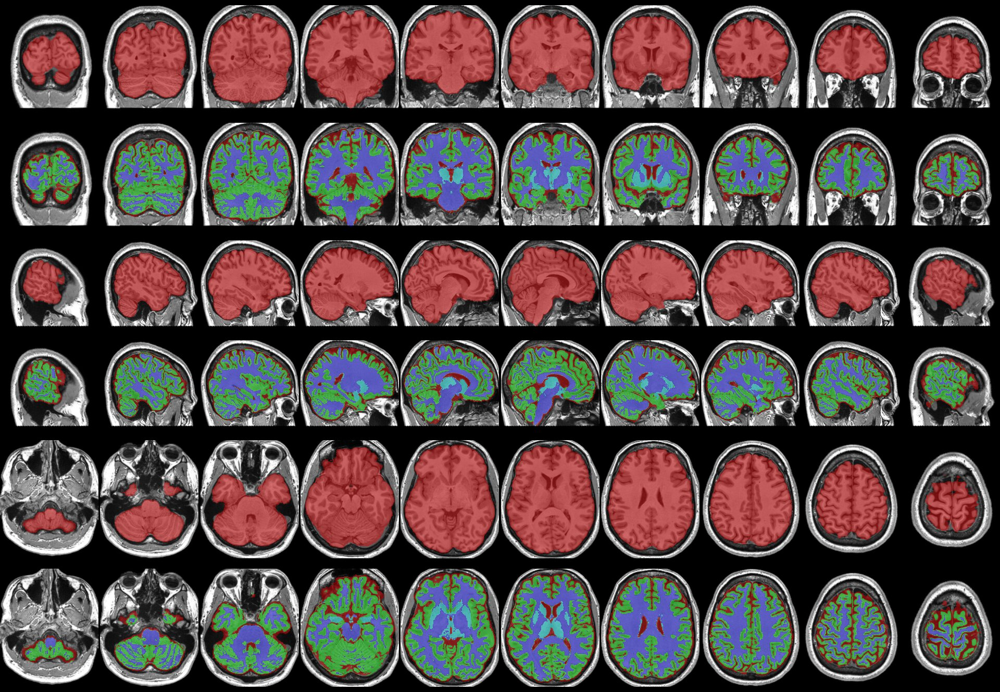
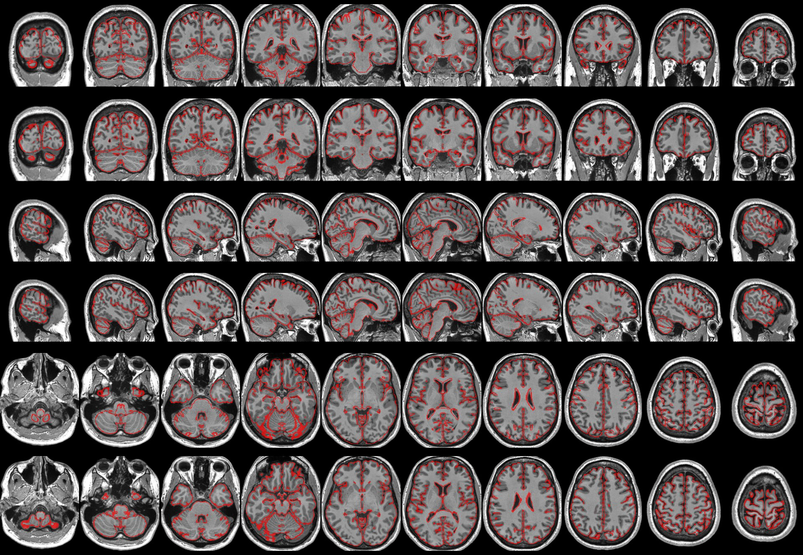

# synthstrip_N3 -- A Human T1w Preprocessing Script

synthstrip_N3 is an MRI preprocessing pipeline, which at its core is intended
to correct inhomogeneites (aka bias fields) present in T1-weighted images.

There are two key implementation details which the core design is focused on

1. Implementing a `nu_correct` (aka N3) multi-scale variant similar to `N4BiasFieldCorrection` (aka ITKN4)
2. Iteratively refining the correction to the bias field by classifying the brain
   tissue and focusing on the spatial intensity distribution within that tissue.

In addition, the following standardization steps are performed:

- Intensity range is rescaled 0-65535
- Intensity distribution is centered at 32767
- Intensity histogram is trimmed top and bottom 0.1%
- Head field-of-view is cropped/padded to match the FOV of the MNI ICBM model
- Image intensity outside the head is set to 0

As a side effect of the internal processes it uses to perform correction,
this pipeline also produces a number of secondary outputs suitable for use in
neuroimaging research:

- Registration (affine and non-linear transforms) to a model space (typically MNI ICBM 09c)
- Brain mask
- Brain tissue classification (GM/WM/CSF or GM/DEEPGM/WM/CSF)
- A denoised (via adaptive non-local means) version of the image
- Quality control images

## Dependencies

- minc-toolkit-v2 https://bic-mni.github.io/
- synthstrip from https://surfer.nmr.mgh.harvard.edu/docs/synthstrip/
  - `mkdir -p ~/bin && apptainer build ~/bin/synthstrip docker://freesurfer/synthstrip && chmod +x ~/bin/synthstrip`
- `antsRegistration_affine_SyN.sh` from https://github.com/CoBrALab/minc-toolkit-extras
- ANTs with MINC support enabled https://github.com/ANTsX/ANTs
- Priors (see below)
- imagemagick for a static QC image
- (optionally) img2web from the webp package from google to get animated QC images: https://developers.google.com/speed/webp/download

## Usage

```bash
synthstrip_N3 Human T1w Preprocessing
Usage: ./synthstrip_N3.sh [-h|--help] [--distance <arg>] [--levels <arg>] [--cycles <arg>] [--iters <arg>] [--lambda <arg>] [--fwhm <arg>] [--stop <arg>] [--isostep <arg>] [--prior-config <arg>] [--lsq6-resample-type <arg>] [-c|--(no-)clobber] [-v|--(no-)verbose] [-d|--(no-)debug] <input> <output>
        <input>: Input MINC or NIFTI file
        <output>: Output MINC or NIfTI file (.mnc/.nii/.nii.gz); the extension selects the format. Also used as basename for secondary outputs
        -h, --help: Prints help
        --distance: Initial distance for correction (default: '400')
        --levels: Levels of correction with distance halving (default: '4')
        --cycles: Cycles of correction at each level (default: '3')
        --iters: Iterations of correction for each cycle (default: '50')
        --lambda: Spline regularization value (default: '2.0e-6')
        --fwhm: Intensity histogram smoothing fwhm (default: '0.1')
        --stop: Stopping criterion for N3 (default: '0.00001')
        --isostep: Isotropic resampling resolution in mm for N3 (default: '4')
        --prior-config: Config file to use for models and priors (default: 'mni_icbm152_nlin_sym_09c.cfg')
        --lsq6-resample-type: (Standalone) Type of resampling lsq6(rigid) output files undergo, can be "coordinates", "none", or a floating point value for the isotropic resolution in mni_icbm152_t1_tal_nlin_sym_09c space (default: 'none')
        -c, --clobber, --no-clobber: Overwrite files that already exist (off by default)
        -v, --verbose, --no-verbose: Run commands verbosely (off by default)
        -d, --debug, --no-debug: Show all internal commands and logic for debug (off by default)
```

## Outputs

The output format is chosen by the extension of the `<output>` argument: `.mnc`
(default), `.nii`, or `.nii.gz`. All image-volume outputs (the main image, brain
masks, tissue segmentation, denoised image, and LSQ6-space volumes) are written in
that format. Spatial transforms follow suit: in MINC mode they are native MINC
`.xfm` files plus their referenced deformation grids (`.mnc`); in NIfTI mode they
are ITK transforms — a `.mat` affine and `1Warp.nii.gz`/`1InverseWarp.nii.gz`
displacement fields. The `_dseg.tsv` label table and QC images always keep their
native formats.

> **Note:** registration runs natively in the output format, so a `.mnc` and a
> `.nii.gz` run of the same subject are independent fits — their transforms differ by
> sub-voxel noise (~0.04 mm). Within one run everything is consistent. Formats register
> natively because converting the nonlinear MINC grid to an ITK warp hits a reader bug.

Given an output basename `example.mnc` the following outputs are created:

```
 example.mnc
 example_desc-denoised_T1w.mnc
 example_label-brainnocsf_mask.mnc
 example_label-brainwithcsf_mask.mnc
 example_dseg.mnc
 example_dseg.tsv
 example_from-T1w_to-model_desc-affine.xfm
 example_from-T1w_to-model_desc-nonlinear.xfm
 example_from-T1w_to-model_desc-nonlinear_grid0.mnc
 example_from-model_to-T1w_desc-nonlinear.xfm
 example_from-model_to-T1w_desc-nonlinear_grid0.mnc
 example_desc-biasCorrection_qc.jpg
 example_desc-maskClassified_qc.jpg
 example_desc-registration_qc.jpg
 example_qc.webp
```

### Segmentation labels

The discrete tissue segmentation (`_dseg.mnc`) is accompanied by a BIDS
`_dseg.tsv` label lookup table. The `index` column is the pipeline label
(Atropos prior order); `mapping` is the BIDS standard tissue index.

| index | name                    | abbreviation | mapping |
| ----- | ----------------------- | ------------ | ------- |
| 1     | Cerebrospinal Fluid     | CSF          | 3       |
| 2     | Gray Matter             | GM           | 1       |
| 3     | White Matter            | WM           | 2       |
| 4     | Subcortical Gray Matter | SGM          | 9       |

Label 4 (SGM) is only present when a deep gray matter prior (`DEEPGMPRIOR`) is
configured.

## Getting Priors

This pipeline uses the priors available from the MNI at http://nist.mni.mcgill.ca/?page_id=714. The "ANTs" style priors
are modified versions of https://figshare.com/articles/ANTs_ANTsR_Brain_Templates/915436 to work with this pipeline
and available upon request.

## Adding your own priors

If you want to provide your own priors, the following files are required:

- `REGISTRATIONMODEL` - the t1-weighted image
- `REGISTRATIONBRAINMASK` - the brain mask
- `WMPRIOR` - a probability map of white matter
- `GMPRIOR` - a probability map of gray matter
- `CSFPRIOR` - a probability map of CSF
- (if your template is not in MNI space) `MNI_XFM`, an affine transform from your template to MNI ICBM NLIN SYM 09c space

Generate a config file defining these variables and provide it to the `--prior-config` option.

## Quality Control Outputs

`synthstrip_N3.sh` provides 3 quality control images, which provide feedback on the success of the following stages

- `<basename>_desc-biasCorrection_qc.jpg`, alternating rows of the original image and the bias-corrected image
- `<basename>_desc-maskClassified_qc.jpg`, alternating rows of the brain mask image and the classified image
- `<basename>_desc-registration_qc.jpg`, alternating rows of the affine MNI outline image and the nlin MNI outline image

Additionally, `<basename>_qc.webp` an animated image which combines the static images together.

### Bias Field QC Example



### Brain Mask and Classification QC Example



### Registration QC Example


